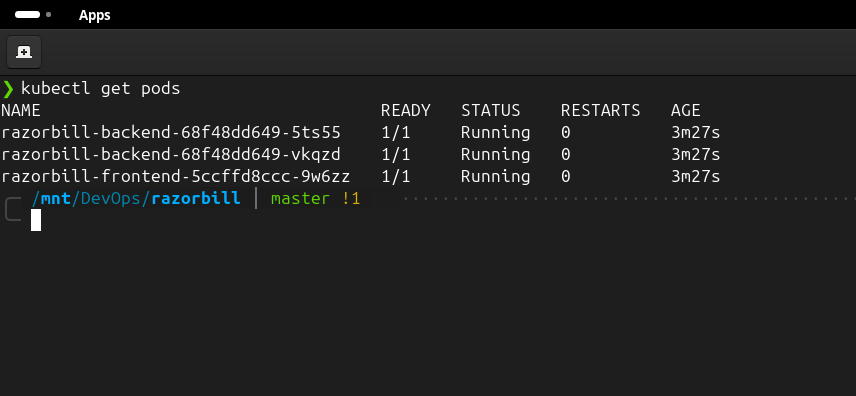
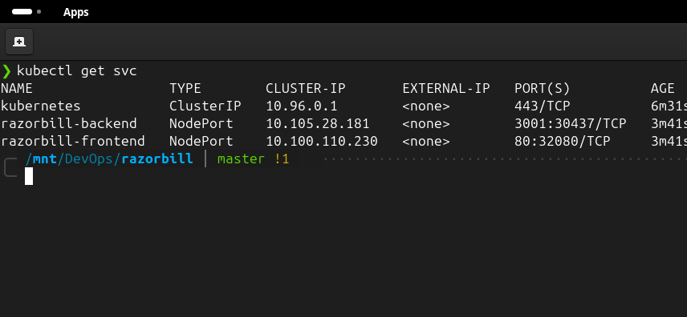
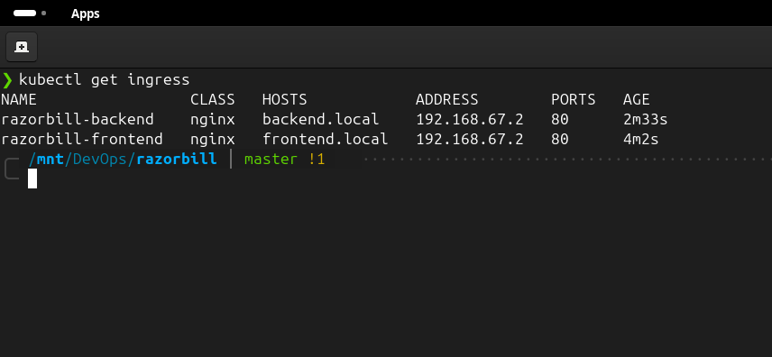
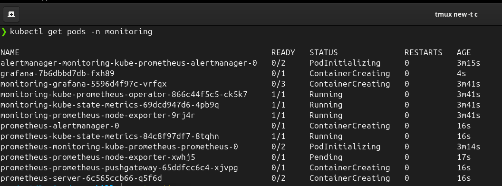
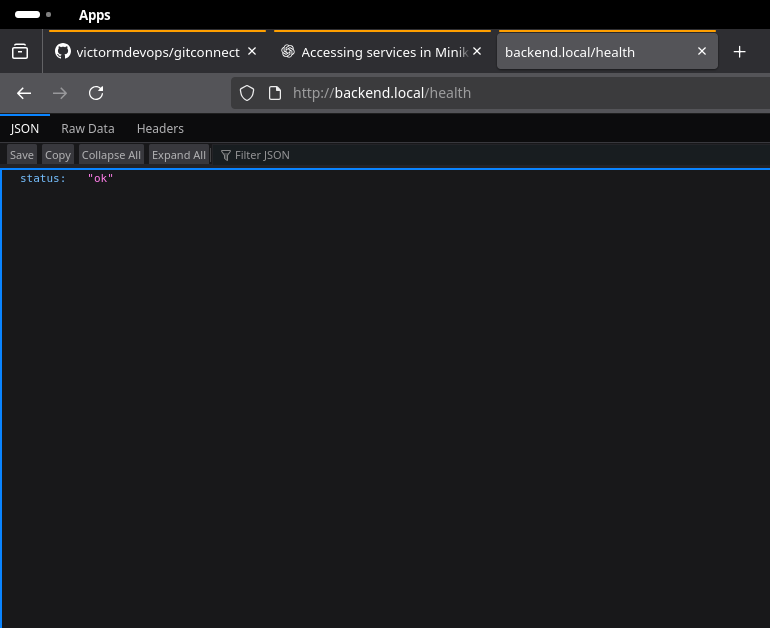
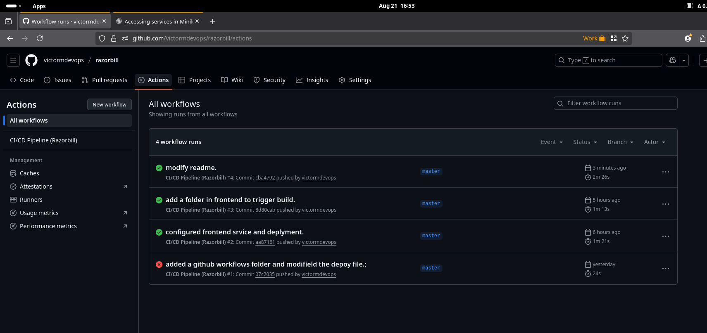
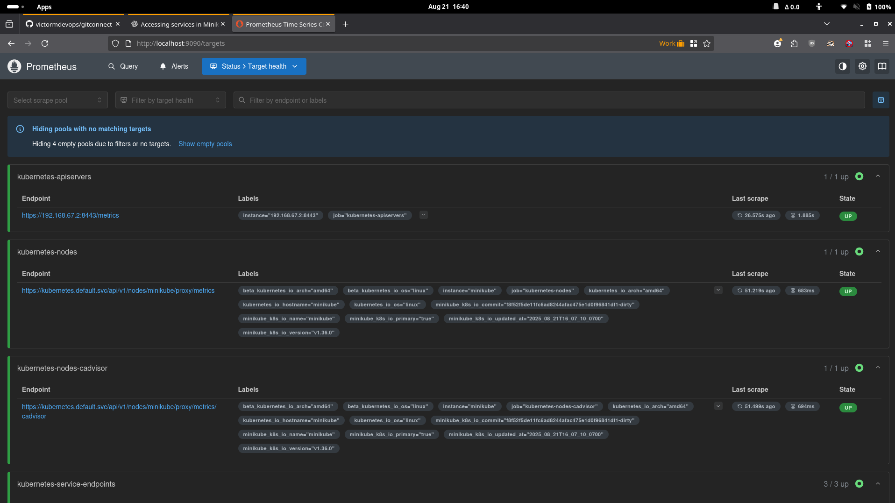
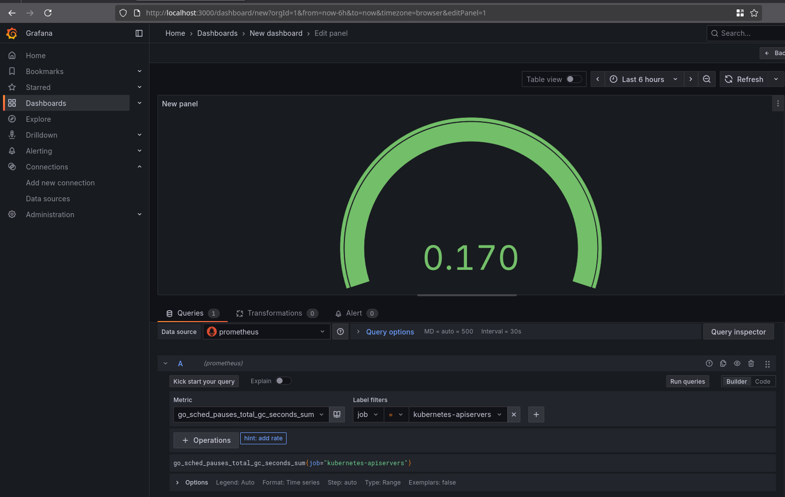

# Razorbill – DevOps CI/CD Project

## 📌 Project Overview

Razorbill is a full-stack web application powered by **MERN**.  
The project demonstrates a complete DevOps workflow, including **containerization, CI/CD pipelines, Kubernetes deployment, and monitoring with Prometheus & Grafana**.

## ⚡ Tech Stack

- **Frontend:** React (Vite) + Nginx  
  **Backend:** MERN
- **Database:** ()
- **Containerization:** Docker
- **Orchestration:** Kubernetes (Minikube / k3d)
- **CI/CD:** GitHub Actions
- **Monitoring:** Prometheus & Grafana

## 🚀 Features

- CI/CD pipeline with automated build & deployment
- Kubernetes manifests for backend, frontend, and services
- Environment variable support with `.env` files
- Monitoring stack (Prometheus + Grafana)
- Scalable deployment with NodePort services

## 📊 Monitoring

- **Prometheus:** collects cluster and application metrics
- **Grafana:** provides visual dashboards for Kubernetes and application insights

## 📐 Architecture Diagram

GitHub Actions (CI/CD)
|
DockerHub Registry
|

---

| |
Frontend (React + Nginx) Backend (Django REST)
| |
------- Kubernetes -------
|
Prometheus + Grafana

## Deployment Proof (Local Minikube)

### Kubectl Pods

### Kubectl Services

### Kubectl Ingress

### Kubectl Monitoring

### Kubectl logs

### Frontend

### Backend

### GitHub Actions Build

### Prometheus

### Grafana

---

## Security and Secrets Management

- No hard-coded credentials in code or manifests
- Sensitive values are managed via **`secret.yaml`**
- Non-sensitive configurations are managed via **`configmap.yaml`**
- Kubernetes Secrets and ConfigMaps are mounted into pods at runtime
- Docker images are built following the least-privilege principle

---

## Why This Project Matters for DevOps

This project demonstrates:

- Multi-service containerization with **Docker**
- **Infrastructure as Code** with Kubernetes manifests
- Automated **CI/CD** with GitHub Actions
- Secure secret and config management using Kubernetes **Secret** and **ConfigMap**
- Health checking and automatic log collection
- **Monitoring with Prometheus** (metrics collection) and **Grafana** (dashboards & visualization)
- Deployment-ready stack that can be extended with full observability

---

## 👨‍💻 Author

**Victor Muthomi**
**DevOps Engineer** | **Cloud & Kubernetes Enthusiast**
